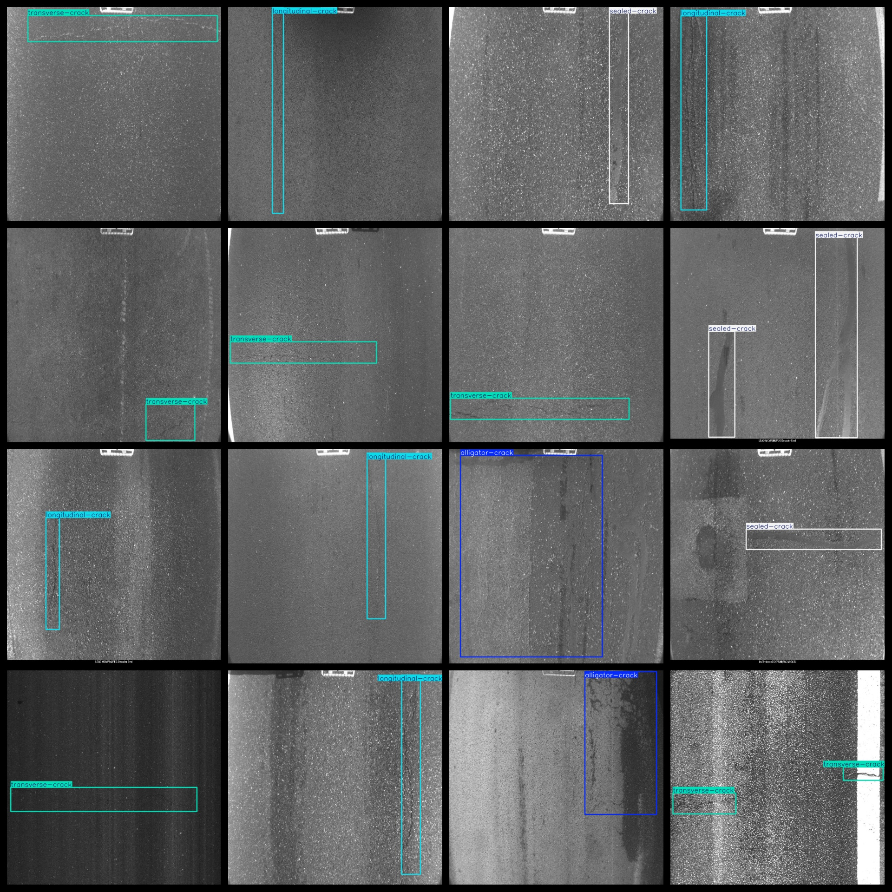
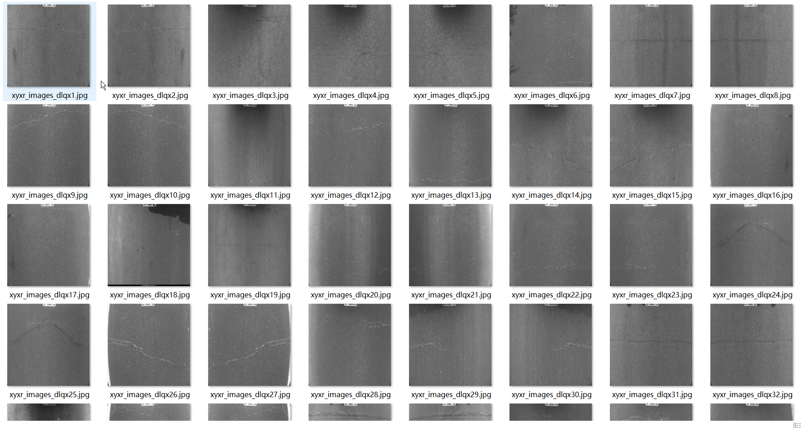

# Low-Altitude Aerial Road Surface Crack Type Detection Dataset - 3391 images, VOC+YOLO format

The dataset includes low-altitude aerial road surface crack type detection. It is organized in the Pascal VOC format and YOLO format, without the txt file containing segmentation paths, only including jpg images and corresponding VOC format xml files and YOLO format txt files. The number of images (jpg files) is 3391, the number of annotations (xml files) is 3391, and the number of annotations (txt files) is 3391. There are 4 types of annotation categories: "alligator-crack", "longitudinal-crack", "sealed-crack", and "transverse-crack".

The GitHub repository for this dataset is: datasets_sl

The annotation category names in the labels folder (not the order in the yolo format): ["alligator-crack", "longitudinal-crack", "sealed-crack", "transverse-crack"]

The Chinese translation of the labels: alligator crack, longitudinal crack, sealed crack, transverse crack

The box counts for each category:

- Alligator-crack box count = 937

- Longitudinal-crack box count = 897

- Sealed-crack box count = 658

- Transverse-crack box count = 1644

Total box count = 4136

The number of images per category:

- Alligator-crack images = 758

- Longitudinal-crack images = 774

- Sealed-crack images = 509

- Transverse-crack images = 1438

The image resolution is 640x640

The annotation tool used is labelImg

This dataset is not enhanced.

Annotation rules: draw boxes around the categories.

Important Note: The dataset does not include training, validation, or test splits; they must be manually defined.

Special Statement: This dataset does not guarantee any level of accuracy on the trained models or the weight files.

The annotation and image details are as follows:

## Images

---

Here is a pay link on Stripe (https://buy.stripe.com/3cs8yP7sY87d0vu9AB). Please contact me lonlonago@foxmail.com after funding $89, and I will send you a complete data files, thank you!

